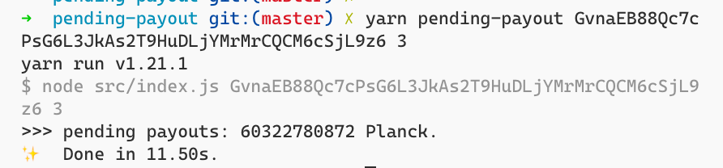

## REST APIs - Read an account's pending payouts

### Prepare

1. Run `yarn` to install dependencies.
2. Run `yarn sidecar` to spin up a substrate sidecar instance.

### Usage

To query pending payout, run `yarn pending-payout your_addr depth`.

### Screenshot

